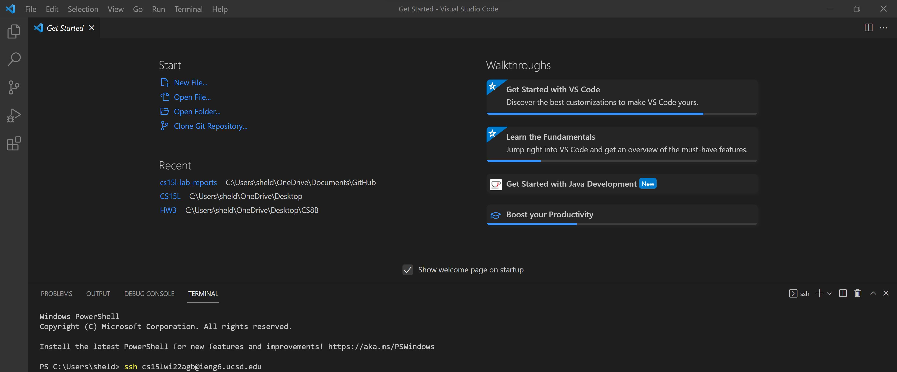

# Lab Report #1
## How to log into your ieng6 account
**Step 1- VS Code Install**

First go to the vs code website [https://code.visualstudio.com](https://code.visualstudio.com/). Download the version from your platform. Open the .exe file and follow the steps for set up. 

After the install it should open to this

**Step 2- Remotely Connecting**

You can connect to your ieng6 from your own device from the terminal line in VS Code, but first you must install the program OpenSSH [here](https://docs.microsoft.com/en-us/windows-server/administration/openssh/openssh_install_firstuse). Your password must be activated with your school info at [https://sdacs.ucsd.edu/~icc/index.php](https://sdacs.ucsd.edu/~icc/index.php). After install and password activation open a new terminal using the tab at the top in VSCode and use the ssh along with your course specific username that ends with @ieng6@ucsd.edu.

The terminal will prompt for password and look like below when successful.

**Step 3- Trying Some Commands**

There are many commands that can be run from the command terminal.

* cd
* ls
* pwd
* mkdir
* cp
* log out with the command `exit`.

**Step 4- Moving Files**

You are able to move files from your local computer to the remote server using the `scp` command.

**Step 5- SSH key**

**Step 6- Remote Running**

