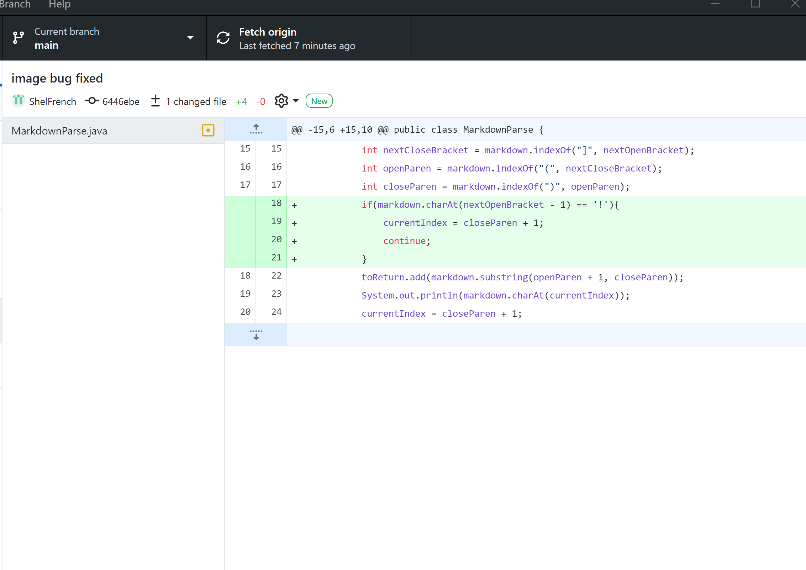
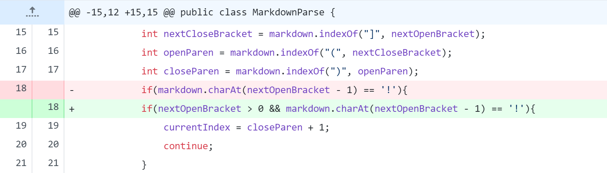
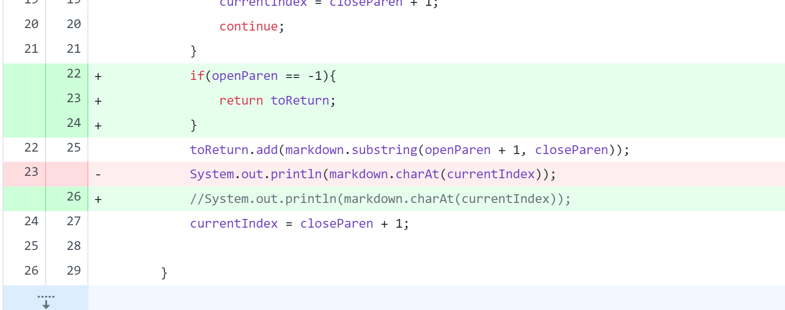

# Lab Report #2
## Bug 1: Image bug fix

[Failed input #1](https://shelfrench.github.io/cs15l-lab-reports/test-file2.md)

Output/Symptom: `[img.pic, https://google.com]`

The bug happened when an input markdown had an image within it. This symptom is seen as the image name is include in with the links. This was fixed with an if statement that checks the char before nextOpenBracket and changes the index if ! is found.

## Bug 2:First Line Link ##

[Failed input #2](https://shelfrench.github.io/cs15l-lab-reports/firstline.md)

Output/Symptom: `Exception in thread "main" java.lang.StringIndexOutOfBoundsException: String index out of range: -1
        at java.base/java.lang.StringLatin1.charAt(StringLatin1.java:47)
        at java.base/java.lang.String.charAt(String.java:693)
        at MarkdownParse.getLinks(MarkdownParse.java:19)
        at MarkdownParse.main(MarkdownParse.java:36)`

This bug occured when the input had a link on the first line of the text. Due to the previous if statement the computer checks the char before a bracket. Since the bracket was the first char there is no char before to check leading to an index out of bound exception. This was fixed by adding to the condional in the iff statement by only running if index is > 0.

## Bug 3: No Parentheses ##

[Failed input #3](https://shelfrench.github.io/cs15l-lab-reports/noParen.md)

Output/Symptom: `Exception in thread "main" java.lang.StringIndexOutOfBoundsException: begin 0, end -1, length 12
        at java.base/java.lang.String.checkBoundsBeginEnd(String.java:3319)
        at java.base/java.lang.String.substring(String.java:1874)
        at MarkdownParse.getLinks(MarkdownParse.java:24)
        at MarkdownParse.main(MarkdownParse.java:34)`

This bug occured when the input had brackets without parentheses. An index out of bounds exception was thrown because there were no parentheses after the brackets. This was fixed with an if statement thet returned if parentheses arent found.