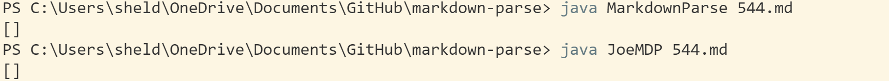

# Lab Report 5

To check results I ran both testfiles in the terminal and compared outputs.

**Test file 403**
My Result

Class Result

My result is incorect as an infinte loop occured with no answer output. The error occurs as their is no stopping place and parse infinetly.

**Test File 544**

Both have the same and correct result

